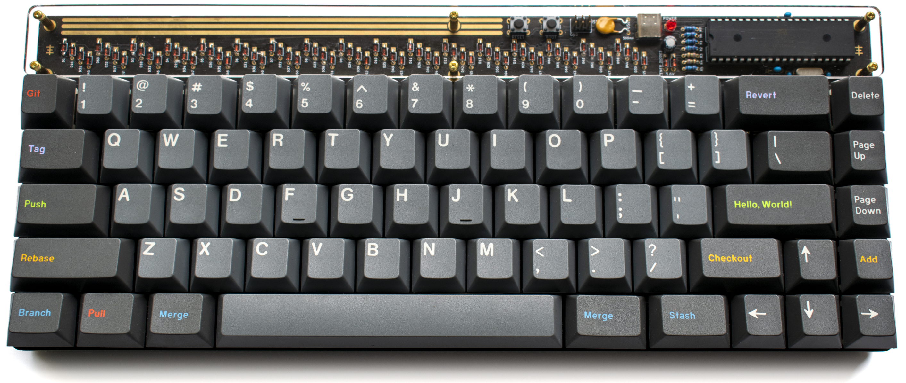
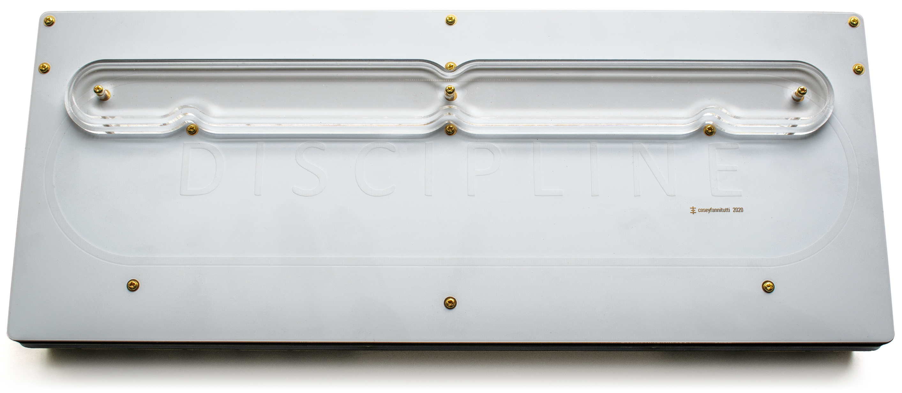
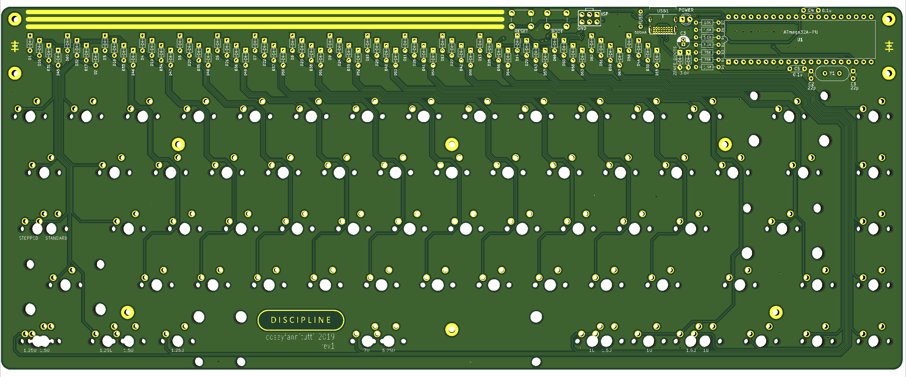
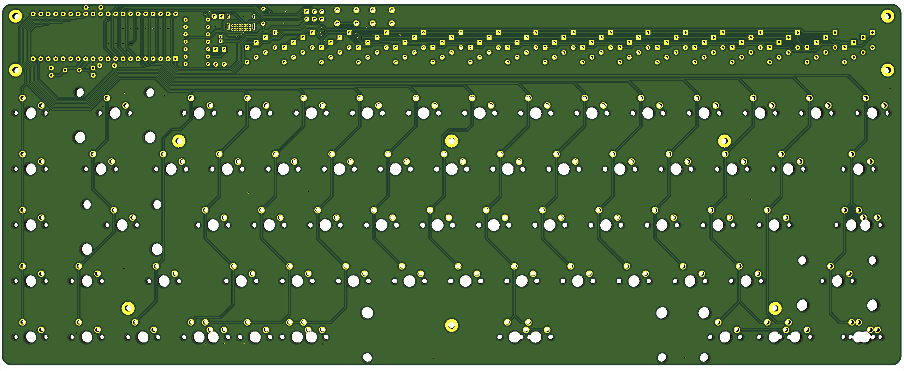
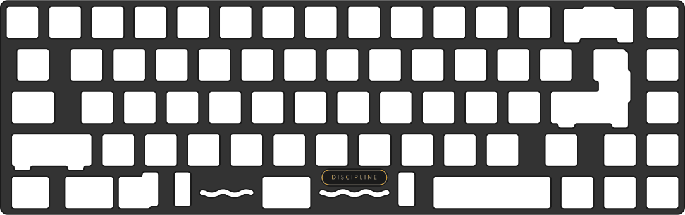

# DISCIPLINE V2

**65% keyboard assembled with only through hole components, including usb type-c**

**[LICENSE](LICENSE)**

Discipline V2 is licensed under the [Creative Commons Attribution-NonCommercial 4.0 International License](https://creativecommons.org/licenses/by-nc/4.0/). 

This PCB design may be freely reproduced, modified, and manufactured for **PERSONAL USE ONLY** and may not be reproduced in physical form for public sale outside of [CFTKB.com](https://www.cftkb.com). 

If you have built upon this work and have changed the design in a significant way, the non-commercial clause can be waived. If you have developed your own design using files in this repository and would like to sell it, please contact me at bryan@cftkb.com. I fully support those looking to make new things and be creative and will more than likely approve and support your project.

**[BOM, Build Guide, and Flashing Information](./doc)**

**Kits available at [cftkb.com](https://www.cftkb.com)**

**[Optional High Profile Lasercut Acrylic Case](./acrylic-case)**

