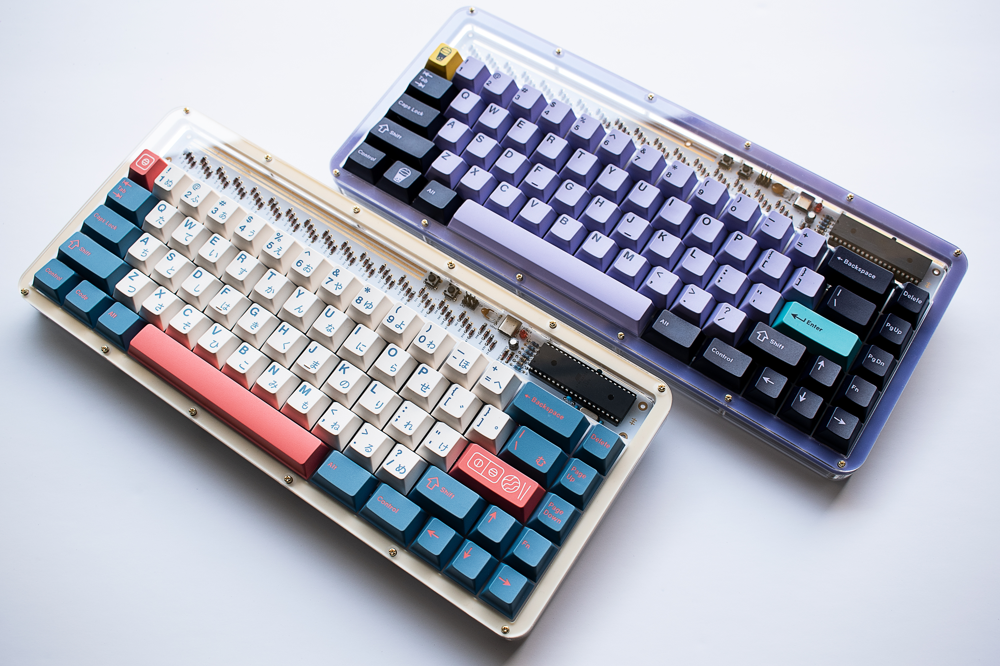

# Lasercut Acrylic Case with POM Plate

***This is case is OPTIONAL and not required. The kit has everything you need for a fully functional keyboard.
This case uses a different plate and is NOT compatible with the plate included in the kit.
If you have already soldered switches, you will need to desolder them and swap the plate.***

***I recommend using [Ponoko](https://www.ponoko.com) to cut the pieces. They have all of the correct/required thicknesses and materials in stock and have the best pricing that I have found for multiple one-off parts. Use clear acrylic for the full range of thickness options and Delrin (POM) for the plate. For proper fit please ensure you use the correct dimensions and material thicknesses noted below. Other colors may be used, but of the colors may have limited thickness options, so you may have to narrow material results by thickness to see which colors are available for that size.***

***Ponoko's automatic size detection when uploading is not flawless, so be sure to manually enter the dimensions below.***

## Part Dimensions/Thickness (Top to Bottom)
1. discipline-top-1.dxf - 320.9 x 138.8 mm - ***2mm thickness CLEAR ACRYLIC***
2. discipline-top-2.dxf ***x2 needed*** - 320.9 x 138.8 mm - ***3mm***
3. discipline-plate.dxf - 320.9 x 138.8 mm - ***1.5mm thickness DELRIN(POM)*** Can be black or white.
4. discipline-open-layer.dxf - 320.9 x 138.8 mm - ***4.5mm thickness***
5. discipline-closed-layer.dxf - 320.9 x 138.8 mm - ***3mm thickness***
6. discipline-bottom.dxf - 320.9 x 138.8 - ***3mm thickness*** Use matte (frosted) or colored acrylic if you don't want to clean up the flux on the bottom of your PCB.
7. discipline-foot-1.dxf - 276.5 x 28mm - ***3mm thickness***
8. discipline-foot-2.dxf - 272.5 x 24mm - ***3mm thickness***
9. discipline-foot-3.dxf - 268.5 x 20mm - ***3mm thickness***

## Screws and Standoffs
1. [30x m2x5mm screws](https://www.aliexpress.com/item/32870342767.html?spm=a2g0o.productlist.0.0.27966799mfy194&algo_pvid=98f7a66e-57d9-4ca1-95a8-3b2bc99288b9&algo_expid=98f7a66e-57d9-4ca1-95a8-3b2bc99288b9-13&btsid=da4f7f18-e93d-4ac9-b663-3a1246c85e80&ws_ab_test=searchweb0_0,searchweb201602_7,searchweb201603_53)
2. [12x m2x14mm standoffs](https://www.aliexpress.com/item/32968906213.html?spm=a2g0o.productlist.0.0.265047aaJgjb3X&algo_pvid=cd49ee05-cc1d-4ee2-adb1-eb3f27e62dc2&algo_expid=cd49ee05-cc1d-4ee2-adb1-eb3f27e62dc2-18&btsid=dcb8921a-e3ef-46a9-ae35-4c76361d9e36&ws_ab_test=searchweb0_0,searchweb201602_7,searchweb201603_53)
3. [3x m2x5mm standoffs](https://www.aliexpress.com/item/32968906213.html?spm=a2g0o.productlist.0.0.265047aaJgjb3X&algo_pvid=cd49ee05-cc1d-4ee2-adb1-eb3f27e62dc2&algo_expid=cd49ee05-cc1d-4ee2-adb1-eb3f27e62dc2-18&btsid=dcb8921a-e3ef-46a9-ae35-4c76361d9e36&ws_ab_test=searchweb0_0,searchweb201602_7,searchweb201603_53)

