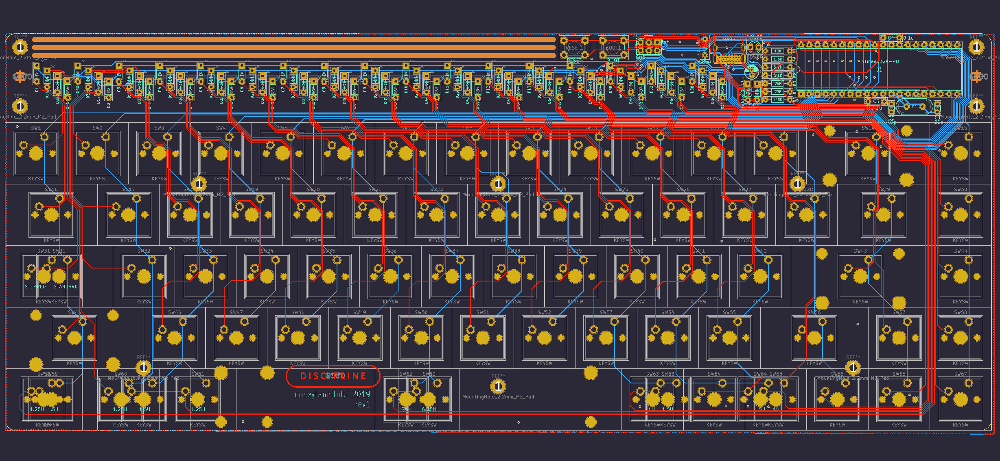

# DISCIPLINE

[Build Guide](https://www.cftkb.com/s/DISCIPLINE-BUILD-GUIDE.pdf)

[VIA Configurator Guide (Easiest)](https://static1.squarespace.com/static/5c533d33348cd92b886e544d/t/5e9fd1d198a4166c9ccc5b68/1587532241535/DISCIPLINE+VIA+GUIDE.pdf)

[QMK Toolbox Flashing Guide (not needed if using VIA)](https://static1.squarespace.com/static/5c533d33348cd92b886e544d/t/5e9fd3311e3c4e5bc9f8eb21/1587532594225/DISCIPLINE+FLASHING+GUIDE.pdf)

[Command Line Flashing Guide (Advanced)](https://static1.squarespace.com/static/5c533d33348cd92b886e544d/t/5e9fd3567e131c476b0a4f7e/1587532631133/DISCIPLINE+FLASHING+GUIDE+-+COMMAND+LINE.pdf)

[Bootloader](./bootloader)

[BOM (Parts List)](https://octopart.com/bom-tool/W4rybyut)