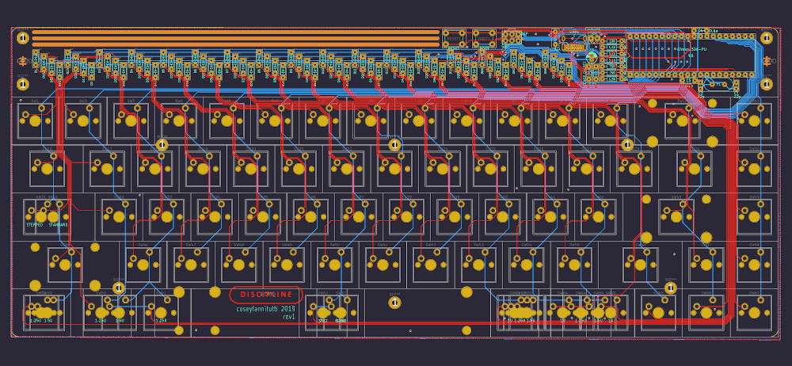

# DISCIPLINE

[Build Guide]()

[QMK Flashing Guide]()

[BOM (Parts List)](https://octopart.com/bom-tool/W4rybyut)

Please note digikey is currently out of stock for the usb connector on this project. They have told me they should be back in stock in on or around September 7.

If you are in the UK you can buy USB4085 type-c connectors from https://uk.farnell.com/

For the US or any other country you can purchase from their export site: https://export.farnell.com/

I am in the US and purchased them from the export site and recieved them in about 4 days and paid $3.50 for shipping.
